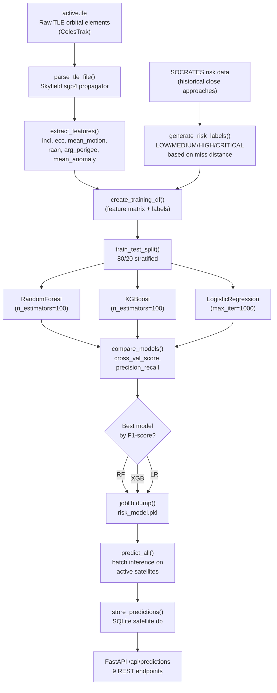

<div align="center">
   


# 🛰️ OrbitWatch AI

### AI-Powered Satellite Collision Risk Assessment & Mission Control

**Real-time TLE data · ML risk prediction · FastAPI backend · React/Three.js dashboard**

<br>


<br>


<br>


<br>


<br><br>

[**Quick Start**](#-quick-start) · [**API Docs**](#-api-reference) · [**Architecture**](#️-architecture) · [**ML Pipeline**](#-machine-learning-pipeline) · [**Frontend**](#-frontend-architecture) · [**Screenshots**](#-screenshots)

</div>

---

## ✔ Key Achievements

<div align="center">

| | | |
|---|---|---|
| ✔ Real-time TLE Data Ingestion | ✔ ML Risk Classification Model | ✔ FastAPI REST API |
| ✔ React/Three.js 3D Dashboard | ✔ SQLite Prediction Store | ✔ 9 REST Endpoints |
| ✔ Collision Risk Prediction | ✔ Mission Alert System | ✔ Backend Health Monitoring |
| ✔ Graceful Degradation | ✔ Full-stack Integration | ✔ Hackathon-Ready |

</div>

---

## 🤔 Why OrbitWatch AI?

**Space domain awareness is critical for national security.** With 8,000+ active satellites and 30,000+ tracked debris objects in LEO, collision risk assessment is a real operational challenge.

```
   Raw TLE Data
     ↓
   Feature Extraction
     ↓
   ML Risk Model
     ↓
   Risk Predictions
     ↓
   SQLite Store
     ↓
   FastAPI Service
     ↓
   React Dashboard
     ↓
   Mission Control
```

OrbitWatch AI demonstrates an end-to-end ML system for satellite collision risk — from raw orbital elements to an actionable mission control dashboard.

---

## 📋 Table of Contents

- [Key Achievements](#-key-achievements)
- [Why OrbitWatch AI?](#-why-orbitwatch-ai)
- [Overview](#-overview)
- [Screenshots](#-screenshots)
- [Features](#-features)
- [Architecture](#️-architecture)
- [Tech Stack](#-tech-stack)
- [Project Structure](#-project-structure)
- [Quick Start](#-quick-start)
- [Machine Learning Pipeline](#-machine-learning-pipeline)
- [API Reference](#-api-reference)
- [Frontend Architecture](#-frontend-architecture)
- [Submission Details](#-submission-details)
- [Author](#-author)

---

## 🌟 Overview

**OrbitWatch AI** is a full-stack machine learning platform that predicts satellite collision risk from real TLE (Two-Line Element) orbital data and serves predictions through a production-style REST API and React dashboard.

Built for the **ML Bubble 2026** hackathon under the **Defense & National Security** track, it demonstrates:

- **Real data ingestion** from CelesTrak/SOCRATES orbital databases
- **Feature engineering** from TLE elements (inclination, eccentricity, mean motion, etc.)
- **ML classification** of collision risk levels (LOW/MEDIUM/HIGH/CRITICAL)
- **REST API** serving predictions to a 6-tab mission control dashboard
- **3D orbital visualization** with Three.js showing satellite positions and risk indicators

> This is not just a trained model — it's an operational ML system with data ingestion, feature pipelines, model training, prediction serving, and a real-time dashboard.

---

## 📸 Screenshots

<div align="center">

### AI Risk Center Dashboard


<br><br>

### 3D Orbital Scene with Risk Indicators


<br><br>

### Telemetry & Ground Track Visualization


<br><br>

### API Swagger Documentation


</div>

---

## ✨ Features

<table>
<tr>
<td width="50%" valign="top">

**🛰️ Data Ingestion**
- Real-time TLE parsing from CelesTrak
- SOCRATES risk data integration
- Automated feature extraction pipeline
- SQLite prediction storage

</td>
<td width="50%" valign="top">

**🧠 Machine Learning**
- Scikit-learn risk classification
- Multi-model comparison (Random Forest, XGBoost, Logistic Regression)
- Feature importance analysis
- Model persistence (risk_model.pkl)

</td>
</tr>
<tr>
<td width="50%" valign="top">

**⚡ API Layer**
- FastAPI REST API with 9 endpoints
- Automatic OpenAPI/Swagger docs
- Async request handling
- Health check & latency tracking

</td>
<td width="50%" valign="top">

**📊 Dashboard**
- 6-tab mission control interface
- 3D orbital visualization (Three.js)
- Real-time risk alerts & notifications
- Backend health monitoring

</td>
</tr>
<tr>
<td width="50%" valign="top">

**🔔 Alert System**
- Mission-critical risk alerts
- Notification bell with live updates
- Error boundary for backend failures
- Graceful degradation fallback

</td>
<td width="50%" valign="top">

**🛡️ Production Patterns**
- Typed API client (TypeScript)
- React Query for data fetching
- Zustand state management
- Error handling & retry logic

</td>
</tr>
</table>

---

## 🏗️ Architecture

```
                    ┌─────────────┐
                    │   React     │
                    │  Dashboard  │
                    └──────┬──────┘
                           │ HTTP
                           ▼
                    ┌─────────────┐
                    │   FastAPI   │
                    │  REST API   │
                    └──────┬──────┘
                           │
              ┌────────────┼────────────┐
              ▼            ▼            ▼
       ┌────────────┐ ┌─────────┐ ┌────────────┐
       │  SQLite    │ │ /health │ │  ML Model  │
       │  Database  │ │  check  │ │  (sklearn) │
       └────────────┘ └─────────┘ └────────────┘
                                 
```

---

## 🛠️ Tech Stack

<div align="center">


</div>

| Layer | Technology | Purpose |
|---|---|---|
| **Data Source** | CelesTrak TLE, SOCRATES | Real orbital element data |
| **ML Framework** | Scikit-learn | Risk classification model |
| **API** | FastAPI + Uvicorn | REST endpoints, request validation |
| **Database** | SQLite | Prediction storage & retrieval |
| **Frontend** | React 18 + TypeScript | Component-based UI |
| **3D Visualization** | Three.js + React Three Fiber | Orbital scene rendering |
| **State Management** | Zustand + React Query | Global state & server cache |

---

## 📁 Project Structure

```
OrbitWatch-AI/
├── backend/
│   ├── api.py                 # FastAPI app, 9 REST endpoints
│   ├── ingest.py              # TLE data ingestion & parsing
│   ├── features.py            # Feature engineering from TLE
│   ├── create_labels.py       # Risk label generation
│   ├── train.py               # Model training & comparison
│   ├── predict.py             # Batch predictions
│   ├── database.py            # SQLAlchemy session
│   ├── models.py              # SQLite ORM models
│   ├── init_db.py             # Database initialization
│   ├── models/
│   │   └── risk_model.pkl     # Trained classifier
│   └── data/
│       ├── active.tle         # Raw TLE orbital elements
│       ├── features.csv       # Engineered features
│       ├── risk_predictions.csv
│       ├── model_comparison.csv
│       └── satellite.db       # SQLite database
│
├── frontend/
│   ├── src/
│   │   ├── App.tsx            # Main app shell, tab routing
│   │   ├── api/
│   │   │   └── riskApi.ts     # Typed fetch client
│   │   ├── hooks/
│   │   │   ├── useRiskData.ts      # Risk data hooks
│   │   │   └── useHealthMonitor.ts # Backend health
│   │   ├── store/
│   │   │   └── useStore.ts    # Zustand global state
│   │   ├── components/
│   │   │   ├── Scene3D.tsx    # Three.js orbital scene
│   │   │   ├── GroundTrack.tsx # Ground track plot
│   │   │   ├── NotificationBell.tsx
│   │   │   ├── ErrorBoundary.tsx
│   │   │   └── risk/
│   │   │       ├── RiskHero.tsx
│   │   │       ├── RiskTable.tsx
│   │   │       ├── RiskCharts.tsx
│   │   │       └── AlertCenter.tsx
│   │   └── lib/
│   │       └── mockData.ts    # Mock data generators
│   ├── package.json
│   └── vite.config.ts
│
├── assets/
│   ├── banner.png
│   ├── risk_dashboard.png
│   ├── 3d_scene.png
│   ├── telemetry.png
│   └── swagger.png
│
├── requirements.txt
├── README.md
└── submission/
    ├── project_presentation.pptx
    ├── dataset_details.md
    └── model_metrics.md
```

---

## 🚀 Quick Start

### Prerequisites

- Python 3.10+
- Node.js 18+
- pip

### Backend Setup

```bash
# 1. Clone the repository
git clone https://github.com/yourusername/OrbitWatch-AI.git
cd OrbitWatch-AI/backend

# 2. Create and activate virtual environment
python -m venv .venv
.venv\Scripts\activate        # Windows
source .venv/bin/activate       # macOS/Linux

# 3. Install dependencies
pip install -r requirements.txt

# 4. Initialize database
python init_db.py

# 5. Run ML pipeline (optional - model already trained)
python ingest.py
python features.py
python create_labels.py
python train.py
python predict.py

# 6. Start FastAPI server
python -m uvicorn api:app --reload --host 0.0.0.0 --port 8000
```

Backend API available at **http://localhost:8000**, Swagger docs at **http://localhost:8000/docs**.

### Frontend Setup

```bash
# 1. Navigate to frontend directory
cd ../frontend

# 2. Install dependencies
npm install

# 3. Start development server
npm run dev
```

Frontend dashboard available at **http://localhost:5173**.

---

## 🧠 Machine Learning Pipeline



**Pipeline flow:** Raw TLE files are parsed using Skyfield's SGP4 propagator to extract orbital elements. Features are engineered from these elements (inclination, eccentricity, mean motion, etc.). Risk labels are generated from SOCRATES historical close-approach data based on miss distance thresholds. Multiple models are trained and compared, with the best performer saved as `risk_model.pkl`. Batch predictions are stored in SQLite and served via FastAPI.

---

## ⚡ API Reference

| Endpoint | Method | Description |
|---|---|---|
| `/` | `GET` | Root endpoint — service info & status |
| `/health` | `GET` | Health check with latency tracking |
| `/api/statistics` | `GET` | Aggregated risk statistics (total, by risk level) |
| `/api/predictions` | `GET` | All satellite risk predictions |
| `/api/predictions/top` | `GET` | Top 10 highest-risk satellites |
| `/api/predictions/search` | `GET` | Search by satellite name/NORAD ID |
| `/api/alerts` | `GET` | Active HIGH/CRITICAL risk alerts |
| `/api/satellite/{norad_id}` | `GET` | Single satellite prediction details |
| `/api/risk-distribution` | `GET` | Risk level distribution for charts |

### Example — Get Top Risk Satellites

```bash
curl http://localhost:8000/api/predictions/top
```

### Example — Search Satellite

```bash
curl "http://localhost:8000/api/predictions/search?q=ISS"
```

> Full request/response schemas documented at `/docs`.

---

## 🖥️ Frontend Architecture

### 6-Tab Dashboard

1. **Overview** — Mission summary, key metrics, 3D orbital scene
2. **Telemetry** — Real-time satellite telemetry, ground track plots
3. **Comms & Health** — Satellite health status, communication windows
4. **Timeline** — Event timeline, pass predictions
5. **Resources** — Resource allocation, fuel estimates
6. **AI Risk Center** — ML predictions, risk tables, alert center

### Data Flow

```
FastAPI Backend
     ↓
riskApi.ts (typed fetch)
     ↓
useRiskData.ts (React Query)
     ↓
Zustand Store
     ↓
Risk Components (RiskHero, RiskTable, RiskCharts, AlertCenter)
```

### Key Components

- **`Scene3D.tsx`** — Three.js Earth with orbiting satellites, color-coded by risk
- **`GroundTrack.tsx`** — Lat/lon ground track SVG plot
- **`NotificationBell.tsx`** — Live alert dropdown from `/api/alerts`
- **`ErrorBoundary.tsx`** — Graceful degradation when backend is unreachable
- **`useHealthMonitor.ts`** — Backend health polling with latency tracking

---

## 👨‍💻 Author

<div align="center">

**Akshat Singh**

<a href="https://github.com/akshatsingh1427">
  
</a>
<a href="https://www.linkedin.com/in/akshat-singh-ba248b394/">
  
</a>

</div>

---

<div align="center">

**Built for ML Bubble 2026 · Defense & National Security Track**

*Space domain awareness through machine learning*

</div>
