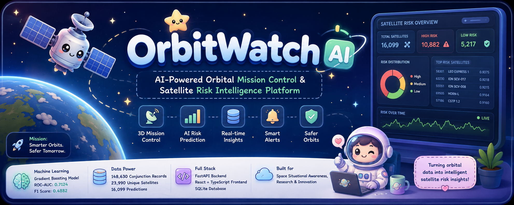
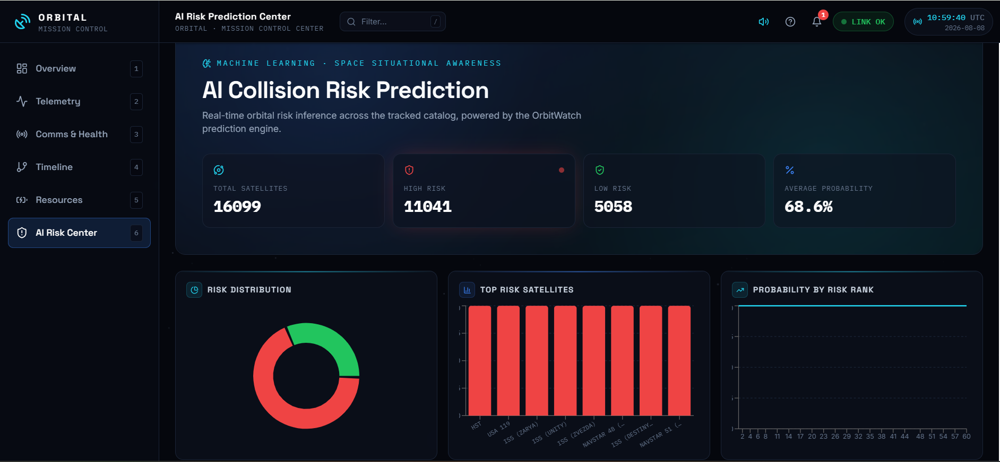
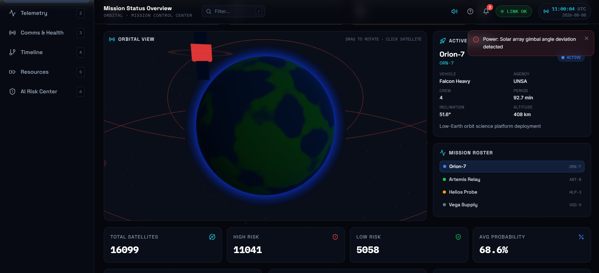
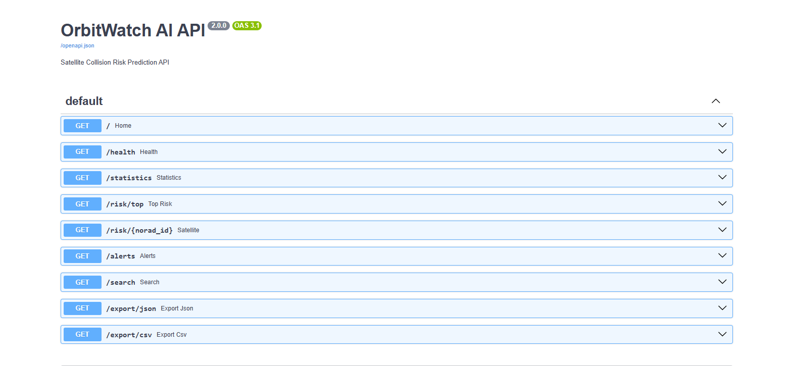
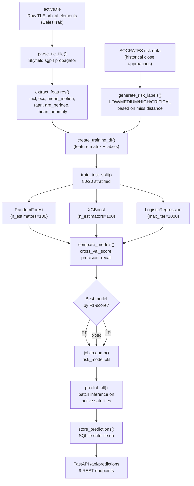

<div align="center">



# 🛰️ OrbitWatch AI

### AI-Powered Orbital Mission Control & Satellite Risk Intelligence Platform

**SOCRATES conjunction analysis · Machine-learning risk prediction · FastAPI backend · React/Three.js 3D dashboard**

<br>


<br>


<br>


<br><br>

[**Quick Start**](#-quick-start) ·
[**Architecture**](#️-architecture) ·
[**ML Pipeline**](#-machine-learning-pipeline) ·
[**API Reference**](#-api-reference) ·
[**Frontend**](#-frontend-architecture) ·
[**Screenshots**](#-screenshots)

</div>

---

## 🌌 Overview

**OrbitWatch AI** is a full-stack machine-learning platform for satellite orbital-risk analysis.

The system processes **SOCRATES satellite conjunction data** and orbital features to generate machine-learning-based satellite risk predictions. These predictions are stored in a SQLite database and exposed through a FastAPI REST API, which powers an interactive React and Three.js mission-control dashboard.

The project combines:

- Satellite orbital and conjunction data
- SOCRATES conjunction analysis
- Feature engineering
- Machine-learning risk prediction
- FastAPI backend
- SQLite database
- React and TypeScript frontend
- Three.js and React Three Fiber visualization
- Risk alerts and satellite search
- Prediction data export

> **Disclaimer:** OrbitWatch AI is an educational and research-oriented decision-support platform. Its machine-learning risk score is not an official physical collision probability and must not be used as the sole basis for real-world satellite maneuver decisions.

---

## 🎯 Problem Statement

As the number of satellites and orbital objects increases, interpreting the orbital environment becomes increasingly complex.

Raw orbital and conjunction data contains parameters such as:

- Altitude
- Inclination
- Eccentricity
- RAAN
- Mean motion
- Orbital period
- Semi-major axis
- Atmospheric drag-related information
- Conjunction probability
- Time of closest approach
- Close-approach range

At scale, manually interpreting these parameters is difficult. OrbitWatch AI addresses this challenge by combining orbital features with SOCRATES conjunction information and machine learning to provide an interpretable satellite-level risk score.

---

## 💡 Solution Workflow

```text
SOCRATES Conjunction Data
            +
Orbital Satellite Data
            ↓
Data Processing and Aggregation
            ↓
Feature Engineering
            ↓
Risk Label Generation
            ↓
Machine-Learning Training
            ↓
Model Comparison
            ↓
Gradient Boosting Model
            ↓
Risk Prediction
            ↓
SQLite Database
            ↓
FastAPI REST API
            ↓
React + Three.js Dashboard
```

OrbitWatch AI demonstrates an end-to-end orbital-risk analysis system, from data processing and feature engineering to model prediction and mission-control visualization.

---

## 📊 Project Statistics

| Metric | Value |
|---|---:|
| SOCRATES records | 148,630 |
| Unique conjunction satellites | 23,990 |
| Feature/labeled satellites | 16,099 |
| ML features | 8 |
| Models evaluated | 4 |
| Generated predictions | 16,099 |
| Selected model | Gradient Boosting |
| Selected threshold | 0.23 |
| ROC-AUC | 0.7124 |
| PR-AUC | 0.4359 |
| F1 score | 0.4882 |

---

## 📸 Screenshots

### AI Risk Center



### 3D Orbital Visualization



### Telemetry and Ground Track


### FastAPI Swagger Documentation



---

## 🧠 Machine Learning

### Dataset

The project uses SOCRATES conjunction data containing satellite close-approach information.

The processed dataset contains:

- SOCRATES records: `148,630`
- Unique conjunction satellites: `23,990`
- Feature satellites: `16,099`
- Labeled satellites: `16,099`

Important conjunction attributes include:

- `MAX_PROB`
- `TCA_RANGE`
- `NORAD_CAT_ID_1`
- `NORAD_CAT_ID_2`

### Risk Label Generation

SOCRATES conjunction records are aggregated at the satellite level.

The resulting dataset contains:

- `norad_id`
- `object_name`
- `max_conjunction_probability`
- `min_conjunction_range_km`
- `conjunction_count`
- `risk_level`
- `risk_label`

The final binary classification dataset contained:

| Risk label | Samples |
|---:|---:|
| 0 | 12,181 |
| 1 | 3,918 |

**Positive rate:** 24.34%

Risk-level distribution:

| Risk level | Samples |
|---|---:|
| Low | 12,181 |
| Medium | 3,259 |
| High | 659 |

---

## 🧮 Feature Engineering

The final ML model uses eight features:

| Feature | Description |
|---|---|
| `altitude_km` | Approximate orbital altitude |
| `orbital_period_min` | Orbital period in minutes |
| `eccentricity` | Orbital eccentricity |
| `raan_deg` | Right Ascension of the Ascending Node |
| `drag_score` | Derived drag-related feature |
| `semi_major_axis_km` | Orbital semi-major axis |
| `inclination_deg` | Orbital inclination |
| `mean_motion` | Mean orbital motion |

---

## 🧪 Dataset Split

The improved training pipeline used:

| Dataset | Samples |
|---|---:|
| Total samples | 16,099 |
| Training samples | 11,269 |
| Validation samples | 2,415 |
| Test samples | 2,415 |

The split was performed while preserving the class distribution.

---

## 🤖 Model Comparison

Four classification algorithms were evaluated:

| Model | Accuracy | Precision | Recall | F1 Score | ROC-AUC | PR-AUC | Specificity | Balanced Accuracy |
|---|---:|---:|---:|---:|---:|---:|---:|---:|
| Logistic Regression | 0.7302 | 0.3107 | 0.8952 | 0.4563 | 0.6228 | 0.2909 | 0.5713 | 0.7332 |
| Random Forest | 0.7516 | 0.3521 | 0.8976 | 0.4666 | 0.6863 | 0.4172 | 0.6470 | 0.7723 |
| Extra Trees | 0.7571 | 0.3631 | 0.8912 | 0.4780 | 0.7000 | 0.4232 | 0.6678 | 0.7795 |
| **Gradient Boosting** | **0.7684** | **0.3833** | **0.9120** | **0.4882** | **0.7124** | **0.4359** | **0.6808** | **0.7964** |

## Best Performing Model

- **Model:** Gradient Boosting
- **Optimal Threshold:** 0.23

### Performance

- **ROC-AUC:** 0.7124
- **F1 Score:** 0.4882
- **PR-AUC:** 0.4359

The final model is saved as:

```text
backend/models/risk_model.pkl
```

---

## 📈 Feature Importance

The trained tree-based model produced the following feature-importance values:

| Feature | Importance |
|---|---:|
| `altitude_km` | 0.1412 |
| `orbital_period_min` | 0.1394 |
| `eccentricity` | 0.1283 |
| `raan_deg` | 0.1256 |
| `drag_score` | 0.1232 |
| `semi_major_axis_km` | 0.1158 |
| `inclination_deg` | 0.1143 |
| `mean_motion` | 0.1122 |

Altitude was the most influential feature in the feature-importance analysis.

---

## 🔮 Prediction Results

The final prediction pipeline generated:

- Total predictions: `16,099`
- Risk label `1`: `10,882`
- Risk label `0`: `5,217`
- Average predicted probability: `0.2419206501`

Example high-scoring predictions:

| NORAD ID | Satellite | Risk probability | Altitude |
|---:|---|---:|---:|
| 58301 | LEO EXPRESS 1 | 0.9375 | 456.63 km |
| 63230 | ION SCV-017 | 0.9218 | 481.26 km |
| 55051 | ION SCV-008 | 0.9215 | 478.40 km |
| 69505 | HORN-L | 0.9164 | 481.49 km |
| 57186 | CSTP 1.2 | 0.9160 | 476.83 km |

---

## 🏗️ Architecture

```text
                         ORBITWATCH AI
                              │
              ┌───────────────┴───────────────┐
              │                               │
          FRONTEND                         BACKEND
              │                               │
      React + TypeScript                  FastAPI
              │                               │
      React Three Fiber                  REST API
              │                               │
          Three.js                       SQLAlchemy
              │                               │
      Tailwind CSS                         SQLite
                                              │
                              ┌───────────────┴───────────────┐
                              │                               │
                       Risk Predictions                Satellite Snapshots
                              │
                              ▼
                         ML Model
                              │
                     Gradient Boosting
                              │
                              ▼
                       Risk Probability
```

---

## 🧠 Machine Learning Pipeline



**Pipeline flow:** Raw TLE files are parsed using Skyfield's SGP4 propagator to extract orbital elements. Features are engineered from these elements (inclination, eccentricity, mean motion, etc.). Risk labels are generated from SOCRATES historical close-approach data based on miss distance thresholds. Multiple models are trained and compared, with the best performer saved as `risk_model.pkl`. Batch predictions are stored in SQLite and served via FastAPI.

---

## 🗄️ Database

OrbitWatch AI uses SQLite with SQLAlchemy.

Database location:

```text
backend/data/satellite.db
```

### `risk_predictions`

Stores machine-learning predictions.

| Field |
|---|
| `id` |
| `norad_id` |
| `object_name` |
| `risk_label` |
| `risk_probability` |
| `altitude_km` |
| `prediction_time` |

Current prediction records: `16,099`

### `satellite_snapshots`

Stores orbital satellite information.

| Field |
|---|
| `id` |
| `norad_id` |
| `object_name` |
| `epoch` |
| `inclination` |
| `raan` |
| `eccentricity` |
| `arg_perigee` |
| `mean_anomaly` |
| `mean_motion` |
| `bstar` |
| `snapshot_time` |

---

## ⚡ FastAPI Backend

The backend is implemented using:

- Python
- FastAPI
- Uvicorn
- SQLAlchemy
- Pandas
- Scikit-learn
- Joblib
- SQLite

Local backend URL:

```text
http://127.0.0.1:8000
```

---

## 🔌 API Reference

| Endpoint | Method | Description |
|---|---|---|
| `/` | GET | Backend status |
| `/health` | GET | Backend and database health |
| `/statistics` | GET | Fleet-wide risk statistics |
| `/risk/top` | GET | Highest-risk satellites |
| `/risk/{norad_id}` | GET | Individual satellite details |
| `/alerts` | GET | High-risk alerts |
| `/search` | GET | Search satellites by name |
| `/export/json` | GET | Export predictions as JSON |
| `/export/csv` | GET | Export predictions as CSV |

FastAPI automatically provides interactive API documentation:

```text
http://127.0.0.1:8000/docs
```

ReDoc documentation:

```text
http://127.0.0.1:8000/redoc
```

### Example API requests

```bash
curl http://127.0.0.1:8000/health
```

```bash
curl "http://127.0.0.1:8000/risk/top?limit=10"
```

```bash
curl "http://127.0.0.1:8000/search?q=STARLINK"
```

```bash
curl http://127.0.0.1:8000/export/json
```

```bash
curl http://127.0.0.1:8000/export/csv
```

### Example health response

```json
{
  "status": "healthy",
  "database": "connected",
  "predictions": 16099
}
```

### Example statistics response

```json
{
  "total_satellites": 16099,
  "high_risk": 10882,
  "low_risk": 5217,
  "average_probability": 0.2419206501
}
```

### Example top-risk response

```json
{
  "norad_id": 58301,
  "object_name": "LEO EXPRESS 1",
  "risk_label": 1,
  "risk_probability": 0.937524,
  "altitude_km": 456.625
}
```

---

## ⚛️ Frontend Architecture

The frontend is built using:

- React 18
- TypeScript
- Vite
- Tailwind CSS
- Three.js
- React Three Fiber
- React Query

The frontend communicates with the backend through a typed API client.

```text
React UI
   ↓
React Query Hooks
   ↓
Typed API Client
   ↓
FastAPI REST API
   ↓
SQLite Database
   ↓
ML Predictions
```

---

## 🛰️ Dashboard Features

The mission-control interface provides multiple views for exploring the orbital environment.

Main capabilities:

- 3D orbital visualization
- Satellite risk overview
- Risk statistics
- High-risk alerts
- Satellite search
- Individual satellite details
- Orbital parameters
- Backend health status
- Prediction data export
- AI Risk Center

---

## 🌍 3D Visualization

The 3D interface uses:

- Three.js
- React Three Fiber
- Interactive orbital scenes
- Earth visualization
- Satellite visualization
- Risk-aware satellite indicators

Users can interact with the orbital environment and inspect satellite information.

---

## 🔔 Risk Alerts

The backend provides a dedicated alert endpoint:

```text
GET /alerts?limit=25
```

The frontend periodically refreshes alert data and presents high-risk satellites through the mission-control interface.

---

## 🔎 Satellite Search

Users can search satellite names through:

```text
GET /search?q=STARLINK
```

The backend searches the prediction database and returns matching satellites.

---

## 📥 Data Export

OrbitWatch AI supports exporting prediction results.

### JSON

```text
GET /export/json
```

### CSV

```text
GET /export/csv
```

---

## 📁 Project Structure

```text
OrbitWatch-AI/
│
├── backend/
│   ├── api.py
│   ├── database.py
│   ├── models.py
│   ├── ingest.py
│   ├── features.py
│   ├── create_labels.py
│   ├── train.py
│   ├── predict.py
│   ├── predict_all.py
│   ├── init_db.py
│   ├── check_db.py
│   ├── requirements.txt
│   │
│   ├── models/
│   │   └── risk_model.pkl
│   │
│   └── data/
│       ├── active.tle
│       ├── features.csv
│       ├── labels.csv
│       ├── socrates.csv
│       ├── feature_importances.csv
│       ├── model_comparison.csv
│       ├── risk_predictions.csv
│       └── satellite.db
│
├── src/
│   ├── api/
│   │   └── riskApi.ts
│   ├── hooks/
│   ├── components/
│   ├── lib/
│   ├── store/
│   ├── App.tsx
│   ├── main.tsx
│   └── index.css
│
├── public/
├── assets/
│   ├── banner.png
│   ├── risk_dashboard.png
│   ├── 3d_scene.png
│   ├── telemetry.png
│   └── swagger.png
│
├── index.html
├── package.json
├── package-lock.json
├── vite.config.ts
├── tailwind.config.js
├── tsconfig.json
├── tsconfig.node.json
├── postcss.config.js
├── .env.example
├── .gitignore
└── README.md
```

---

## 🚀 Quick Start

### Prerequisites

- Python 3.10+
- Node.js 18+
- npm
- Git

### 1. Clone the repository

```bash
git clone https://github.com/akshatsingh1427/OrbitWatch-AI.git
cd OrbitWatch-AI
```

### 2. Backend setup

```bash
cd backend
python -m venv venv
```

Activate the virtual environment.

Windows:

```bash
venv\Scripts\activate
```

macOS/Linux:

```bash
source venv/bin/activate
```

Install dependencies:

```bash
pip install -r requirements.txt
```

Start the FastAPI server:

```bash
uvicorn api:app --reload
```

Backend:

```text
http://127.0.0.1:8000
```

Swagger documentation:

```text
http://127.0.0.1:8000/docs
```

### 3. Frontend setup

Open another terminal from the project root:

```bash
cd OrbitWatch-AI
npm install
```

Create a `.env` file in the project root:

```env
VITE_API_BASE_URL=http://127.0.0.1:8000
```

Start the frontend:

```bash
npm run dev
```

Frontend:

```text
http://localhost:5173
```

---

## 🔬 Reproducing the ML Pipeline

The repository contains scripts for reproducing the machine-learning workflow.

```bash
cd backend
```

Feature generation:

```bash
python features.py
```

Label generation:

```bash
python create_labels.py
```

Model training:

```bash
python train.py
```

Prediction generation:

```bash
python predict_all.py
```

The trained model is stored at:

```text
backend/models/risk_model.pkl
```

---

## 🧪 Model Evaluation

OrbitWatch AI evaluates models using multiple metrics rather than relying only on accuracy:

- Accuracy
- Precision
- Recall
- F1 score
- ROC-AUC
- PR-AUC
- Confusion matrix

This provides a more meaningful evaluation of risk classification, particularly when positive and negative classes are not perfectly balanced.

---

## ⚠️ Important Disclaimer

OrbitWatch AI is an educational and research-oriented decision-support system.

The generated `risk_probability` is a machine-learning risk score and should not be interpreted as an official physical probability of satellite collision.

Professional conjunction assessment involves additional orbital, uncertainty, covariance, operational, and trajectory information that is outside the scope of this project.

The system should not be used as the sole basis for real-world satellite maneuver decisions.

---

## 🔮 Future Scope

### Machine Learning

- Larger historical datasets
- Additional orbital and conjunction features
- Probability calibration
- Advanced class-balancing techniques
- Hyperparameter optimization
- Temporal validation
- SHAP-based explainability
- Improved collision-risk modeling

### Orbital Intelligence

- Live orbital updates
- TLE propagation
- Historical risk tracking
- Conjunction timeline visualization
- Closest-approach analysis
- Satellite trajectory prediction

### Platform

- Satellite watchlists
- Automated notifications
- Email alerts
- Historical analytics
- Advanced filtering
- Satellite comparison
- User authentication

### Deployment

- Production cloud deployment
- Persistent production database
- HTTPS
- CI/CD
- Monitoring
- Production logging

---

## 🏆 ML Bubble 2026

OrbitWatch AI was developed for:

**ML Bubble 2026 – Machine Learning Awareness & Skill Building Challenge**

**Track:** Defense & National Security

**Project focus:** Machine-learning-based orbital-risk analysis and satellite mission control.

---

## 📌 Project Status

**Completed**

Current system includes:

- ✅ Data processing
- ✅ SOCRATES integration
- ✅ Feature engineering
- ✅ Risk-label generation
- ✅ ML model training
- ✅ Model comparison
- ✅ Threshold optimization
- ✅ Batch prediction
- ✅ SQLite database
- ✅ FastAPI backend
- ✅ REST APIs
- ✅ React frontend
- ✅ 3D visualization
- ✅ Frontend-backend integration
- ✅ GitHub repository

Cloud deployment can be added separately without changing the core machine-learning system.

---

## 👨‍💻 Author

<div align="center">

### Akshat Singh

Computer Science Engineering Student

<a href="https://github.com/akshatsingh1427">
  
</a>

<a href="https://www.linkedin.com/in/akshat-singh-ba248b394/">
  
</a>

</div>

---

<div align="center">

🛰️ **OrbitWatch AI**

Turning orbital data into intelligent satellite-risk insights.

Built for ML Bubble 2026 · Defense & National Security

</div>
